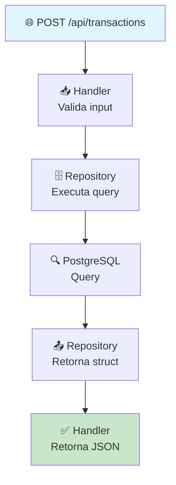

## Fluxo de uma Requisição

--
## Entidades e relacionamentos (Tabelas)
User (1) ──→ (N) Accounts
- ID (UUID)
- Nome
- Email (UNIQUE)
- Telefone
- Endereço
- DataNascimento
- CPF (UNIQUE)
- CreatedAt
- UpdatedAt

Accounts (1) ──→ (N) Transactions
- ID (UUID)
- UserID (FK → User)
- Balance
- Status (active/inactive)
- Type (conta corrente)
- CreatedAt
- UpdatedAt

Transactions
- ID (UUID)
- FromAccountID (FK → Accounts)
- ToAccountID (FK → Accounts)
- Amount
- Type (pix/ted/transfer)
- Status (pending/completed/failed)
- Metadata (JSONB)
- CreatedAt
- CompletedAt (pode ser NULL)

## 🧪 Casos de Uso Pra Estudar
Criar Conta:
Validar CPF (regra de negócio)
Inserir no banco
Retornar ID

Transferência (o mais complexo):
Validar saldo suficiente
Bloquear race conditions (isolation level)
Atualizar ambas contas em transação
Registrar na tabela de transações
Aqui eu estudo: ACID, locks, deadlocks

Listar Transações com Filtros:
Por data, status, tipo
Paginação
Ordenação
Estuda: query optimization, indexes
