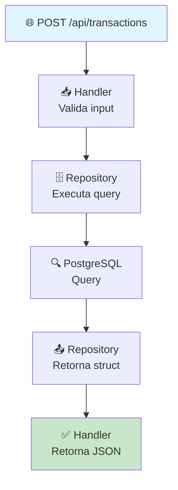

## Fluxo de uma Requisição

## Entidades e relacionamentos (Tabelas)

## 🧪 Casos de Uso Pra Estudar
Criar Conta:
Validar CPF (regra de negócio)
Inserir no banco
Retornar ID

Transferência (o mais complexo):
Validar saldo suficiente
Bloquear race conditions (isolation level)
Atualizar ambas contas em transação
Registrar na tabela de transações
Aqui eu estudo: ACID, locks, deadlocks

Listar Transações com Filtros:
Por data, status, tipo
Paginação
Ordenação
Estuda: query optimization, indexes
